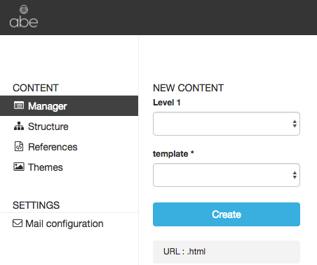
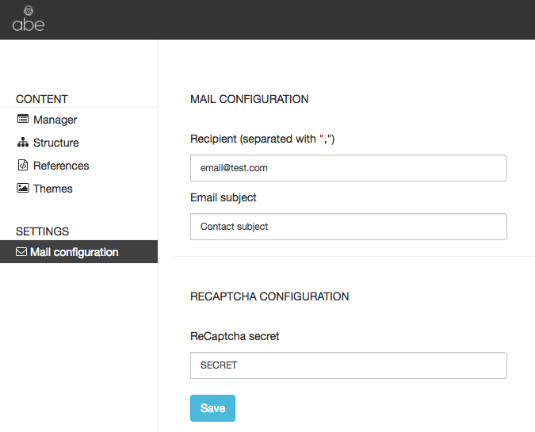

# Plugin mail for [abecms](https://github.com/abecms/abecms)

## Install

####1) Download as zip from github and place it inside your scripts folder

####2) Add this to your root package.json

```
"dependencies": {
	"handlebars": "^4.0.10",
	"sendmail": "^1.1.1"
}
```
####3) Copy mail/script/send-mail-front.js to your assets folder & link this script inside your template

####4) edit constates inside this script to match your need

```
var CONST = {
  POST_URL: 'http://localhost:3000/abe/plugin/mail/send',
  CLASS_BTN_SEND: '.btn-mail',
  FORM_ID: 'gform',
  SUCESS_MSG: '.sucess-mg'
};
```

- POST_URL: is your abe instance followed with this plugin path
- CLASS_BTN_SEND: is the class name of your submit button on your html template
- FORM_ID: is the ID of your form tag
- SUCESS_MSG: this html element will get style display = block after mail success response

important: You have to handle form validation, all this script does is myForm.checkValidity() wich only check browser default validation such as required attribute or type attribute (email, number ...)

####5) open mail/config/index.json

```
{
	"mail": {
		"recipient": "fabrice.labbe@adfab.fr",
		"template": "/scripts/mail/template-mail/contact.html",
		"subject": "this is subject"
	},
	"captcha": {
		"secret": "YOUR_RECAPTCHA_SECRET"
	}
}
```

Change recipient with emails to send the contact mail (separated with ",")


##Example form

On your Abe template you will need to have a form element like this :

```
<form id="gform" action="#" method="POST">
  <input type="text" name="name" required>
  <input type="text" name="country" required>
  <input type="email" name="email" required>
  <!-- only if you use recaptcha -->
  <div class="col-sm-12 g-recaptcha" data-sitekey="YOUR_RECAPTCHA_PUBLIC_KEY" id="g-recaptcha-response"></div>
  <input type="submit" class="btn-mail" value='Submit for contact'>
</form>

<!-- only if you use recaptcha -->
<script src="https://www.google.com/recaptcha/api.js"></script>
<!-- don't forget to load the script -->
<script type="text/javascript" src="/src/send-mail-front.js"></script>
```
Note the ID #gform (form tag) and the class .btn-mail (button submit tab)

##Example email

##Advanced usage

This repository also contains "custom" folder, copy it to your root folder.
This will add a new tab "Mail configuration"



Click on it and you will be able to edit you mail config directly from abems editor



